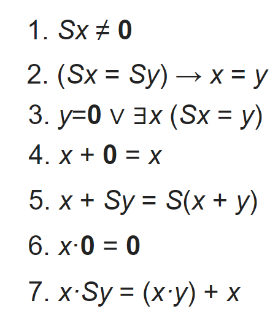
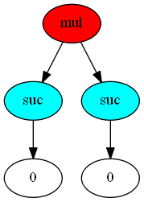
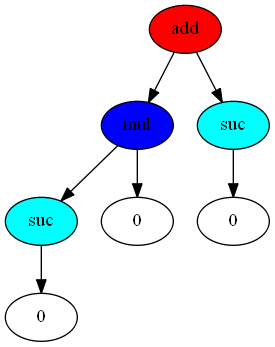
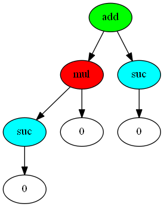
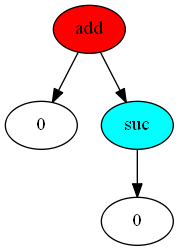
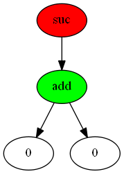
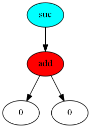
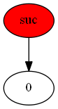
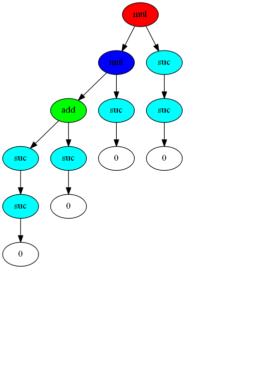

# RewriteRL
RewriteRL is a Python reinforcement learning environment that simulates Robinson arithmetic (RA) and polynomial arithmetic. The environment should be able to parse all problems from Gauthier's [Robinson arithmetic dataset](https://github.com/barakeel/arithmetic_datasets) (training, validation and test set have a combined size of ~30.000 examples) and Piotrowski's [polynomial normalization dataset](https://github.com/BartoszPiotrowski/rewriting-with-NNs/tree/master/data/polynomial) (6 datasets of total size of more than 600.000 examples). These can be loaded into the environment. The goal of the problems in the current version is to rewrite the initial state to the normalized state (goal-oriented rewriting is not yet-possible). We provide a curriculum, where a subset of the problems is laid out in an estimated order of difficulty.

In general, the project hopes to provide a testing ground for reinforcement learning, curriculum learning, neural representations of tree-structured data and more. Later, it could also be used for research into goal-conditioned reinforcement learning. 

RewriteRL provides an Gym-like environment for the development of reinforcement learning algorithms for arithmetical rewriting. One of the goals was to be able to easily draw trees for each expression (see figures below), so that the behavior of the RL algorithms on the problems could be intuitively observed. While RA is not very practically useful, it is complicated enough to possibly serve as a test case for machine learning algorithms. The polynomial arithmetical problems especially look to be very hard to learn with reinforcement learning techniques - with 28 available actions, the space of possible path to take is very large. It also has several variables (x, y, z) that the algorithm will need to reason about. There is also a potential for looping behavior, providing an extra challenge.

Warning: Note that this package is mainly for personal use at the moment, and not all components have been thoroughly tested.
## Primer on Robinson Arithmetic
Robinson arithmetic is a set of rules that can be used to modify expressions. The only operations that are used in Robinson arithmetic are the successor operation, which gives the succesor of a number on the number line (i.e. s(s(0)) = 2), the addition operation and the multiplication operation. There are only a few operations permitted on the expression tree (this is further discussed in the Actions section.) It consists of the following axioms:



# Primer on Polynomial Arithmetic
We use the Tarski axioms of "high school algebra" to implement polynomials over the non-negative numbers. 28 actions are possible, these are the following:
## Installation

Make a new conda environment
```python
conda create -n robinson python=3.7
conda activate robinson
```

Install graphviz (this does not work via pip)
```python
conda install graphviz
```

Install the environment
```
pip install https://github.com/learningeqtp/rewriteRL
```
# Overview
The environment can run in 2 different modes: the Robinson arithmetic mode and the polynomial arithmetic mode. These provide different actions and different sets of problems.
## Actions - Robinson arithmetic
There are currently 10 possible actions for the machine learning algorithms to change the state of the Robinson arithmetic expression tree.

0. x + 0 &rarr; x 
1. x &rarr; x + 0
2. x + s(y) &rarr; s(x + y)
3. s(x + y) &rarr; x + s(y)
4. x * 0 &rarr; 0
5. x * s(y) &rarr; x * y + x
6. x * y + x &rarr;  x * s(y)
7. Move cursor to left child
8. Move cursor to right child
9. Exchange left and right child (this can be disabled)

The last 3 actions do not move the cursor, all other actions reset the cursor to the root of the expression.

## Actions - Polynomial arithmetic
## Example Usage
```python
from rewriterl.env import Robinson
from rewriterl.load_parse import load_dataset

dataset = load_dataset("train")
example, value, difficulty, index = dataset[7]

env = Robinson()
env.load_problem_tree(example, val=value)
env.visualize()
```
This will give you the following image:



The red color indicates that the cursor is currently at the 'mul' node. Using a syntax similar to the openAI gym packages, you can give the environment an action to perform. First, you can check what actions are currently legal at the cursor's position:

```python
print(env.legal_indices())
>>> [1, 5, 7, 8, 9]
```
We can currently perform 5 different actions.
You can refer to the list in the 'Actions' section to learn what actions these numbers refer to.

Let's say we want to perform action 5: 

```python
cursor, state, done = env.step(5)
env.visualize()
```
You should get this image:



As return variables, you get the current cursor subtree, the total tree (state) and a boolean indication whether we are in a winning state (meaning that there are only 'suc' and zeroes in the tree).

Okay, so now we want to move the cursor to the 'mul' node.
```python
cursor, state, done = env.step(7)
env.visualize()
```



Something times 0 is 0, so we can use action 4 now. 
```python
cursor, state, done = env.step(4)
env.visualize()
```



We can now use action 2

```python
cursor, state, done = env.step(2)
env.visualize()
```


 
Now we move the cursor down:

```python
cursor, state, done = env.step(7)
env.visualize()

```




Now we make use of the fact that adding 0 to 0 is 0.

```python
cursor, state, done = env.step(0)
env.visualize()
print(done)
>>> True
```



Done is now True, meaning that we have reached a winning state: the value of the expression was 1 (the successor of 0).

## Demonstration
Below is a demonstration of how the rewriting of a relatively complicated tree looks:


## Dependencies
Robinson-RL uses [Lark](https://github.com/lark-parser/lark)
 as a parsing tool to get the initial states into a tree. The following grammar parses the S-expression dataset:

```python
('''?start: expression
    
                ?expression: atom
                | "+" expression expression -> add
                | "*" expression expression -> mul
                | "SUC" expression -> suc
                | "(" expression ")"
    
                ?atom: NUMBER                
                   
                %import common.NUMBER
                %ignore " "           // Disregard spaces in text
             ''', parser='lalr')
```


